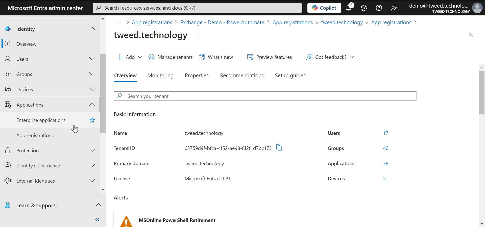
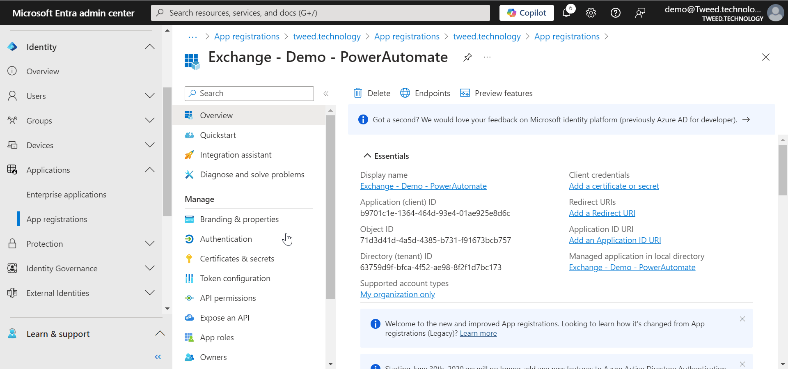
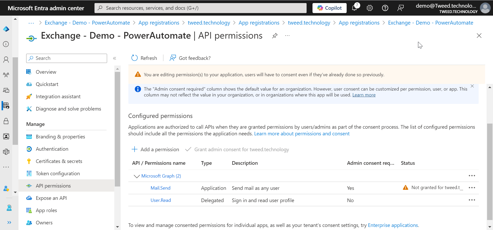

To use this connector you will need to create an application registration.

### Step 1 - Log in to Entra

By default most users will have the ability to go to [https://entra.microsoft.com](https://entra.microsoft.com)
and log in with your user account. 

### Step 2 - Create the app registration

Next we are going to create an application registration so our Power Automate flow can talk directly to Exchange Online.

1. When you are on the Entra Overview page, open up **Identity**.
2. Then navigate to **Applications** in the left hand menu and then open up **App Registrations**. 
3. From there select **New Registration**.
4. A new screen will open, give your new app registration a name and then click next.

### Step 3 - Add API permission

We then need to give our App Registration an API Permission, This will be the permission used to talk to Exchange Online. 

1. In the left hand menu click on **API Permission**.
2. Click on **Add permission**.
3. A window will then open, select **Application Permission**.
4. Then using the search box type in **mail.send**.
5. The list will then filter, as it does open up the **Mail** option and select **mail.send**.

> **NOTE:** Yes this permission lets your send emails as anyone, however we will restrict this later. **DO NOT MISS USE IT IS POSSIBLE TO TRACK WHERE AN EMAIL CAME FROM**.

### Step 4 - Grant Admin consent

1. You will notice that the Grant admin consent is grayed out

2. This is Because we currently lack administrative roles for our account. For this next step you will need a Global Admin. 

3. Ask a Global administrator to grant admin consent for you

