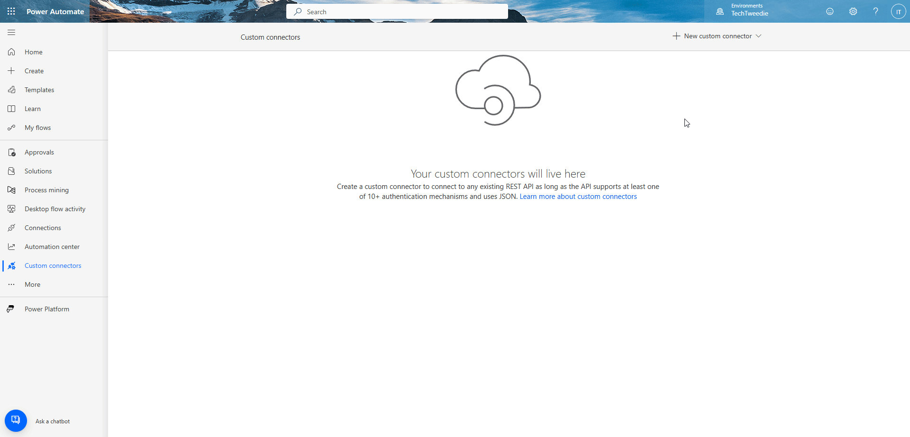
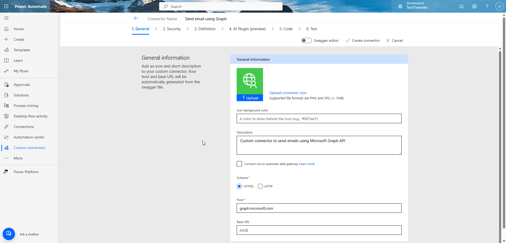
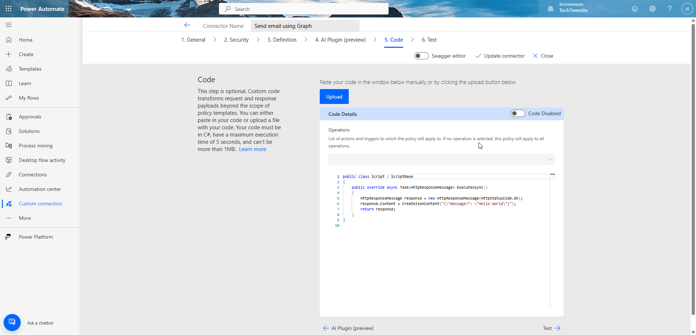
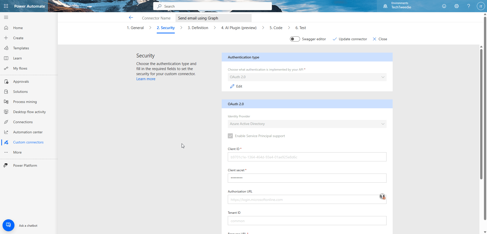
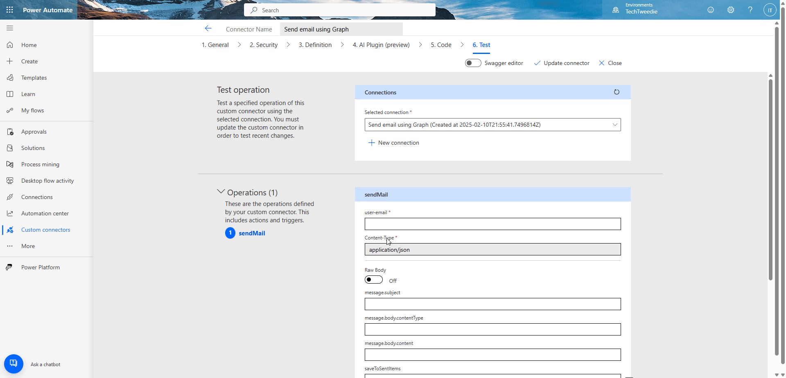
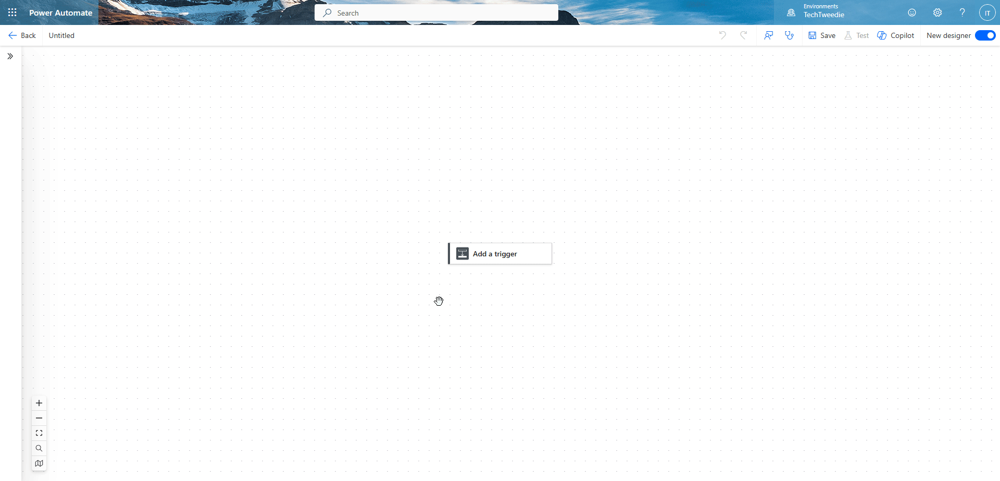

To deploy follow these steps.

### Step 1 - Find custom connectors 
First we need to find custom connectors in Power Automate. 

To do this we need to:

1. Navigate to `https://make.powerautomate.com/`
2. Change our environment should you need to.
3. Then in the left hand menu, navigate to **More** and then **Discover all**, and then locate **Custom connectors**. 


### Step 2 - Create a new connector

1. Click on **New custom connector**.
2. Then click on **Import an OpenAPI from URL**. 
3. Then enter in the connector name `Send email using Graph`.
4. Then enter in the URL `https://raw.githubusercontent.com/itweedie/PowerPlatform-Send-Emails-from-Power-Automate-without-a-Service-Account/refs/heads/main/connector/shared_mightora-5fsend-20mail-20with-20graph-5fe07b0f04a8b0d4c3/apiDefinition.swagger.json`




### Step 3 - Configure your connector

1. Click on to the Security tab.
2. Make sure we are using **OAuth 2.0**
3. Make sure the Identity Provider is set to **Azure Active Directory** and that **Enable Service Principle support** is ticked.
4. Click in to **Client ID**
5. Navigate back to Entra and locate your App Registration. 
6. Copy the **Client ID** and paste it in to the **Client ID** box on the Custom Connector. 
7. Go back to the App Registration in Entra, and click on **Certificates & secrets**, then click on **New client secret**. Choose a name and a reasonable date for expiry that fits within your organisations policy's. 
8. Copy the **Secret value**, NOT Secret ID, and paste it in to your connector. You will need your secret ID one more time so keep the Entra page open with it on.
9. Click Create 



### Step 4 - Add C# to process the attachment
In order to be able to send attachments we need to add some C# to our connector. If you are not going to be sending attachments you can skip this step. 

To do this you need to:
1. Click on to **Code**
2. Click to enable code.
3. Copy and pase the below code in to the code box.

```CSharp
public class Script : ScriptBase
{
    public override async Task<HttpResponseMessage> ExecuteAsync()
    {
        // Read the request content as a string
        var requestContentAsString = await this.Context.Request.Content.ReadAsStringAsync().ConfigureAwait(false);
        
        // Parse the request content string into a JSON object
        var requestContentAsJson = JObject.Parse(requestContentAsString);

        // Modify the attachments array if it exists
        List<string> attachmentFileTypes = new List<string>();

        if (requestContentAsJson["message"]?["attachments"] is JArray attachments)
        {
            foreach (var attachment in attachments)
            {

                // Add the @odata.type element
                attachment["@odata.type"] = "#microsoft.graph.fileAttachment";

            }
        }
        
        // Set the modified JSON back to the request content
        this.Context.Request.Content = CreateJsonContent(requestContentAsJson.ToString());

        // Send the API request and get the response
        var response = await this.Context.SendAsync(this.Context.Request, this.CancellationToken).ConfigureAwait(continueOnCapturedContext: false);

        // Read the response content as a string
        var responseContentAsString = await response.Content.ReadAsStringAsync().ConfigureAwait(false);

        // Check if the response content is empty or null
        if (string.IsNullOrEmpty(responseContentAsString))
        {
            // Set a default message if there is no response from the endpoint
            responseContentAsString = "{\"message\": \"No response from the endpoint\"}";
        }
        else
        {
            try
            {
                // Try to parse the response content string into a JSON object
                var responseContentAsJson = JObject.Parse(responseContentAsString);
                
                // Convert the JSON object back to a string
                responseContentAsString = responseContentAsJson.ToString();
            }
            catch (JsonReaderException)
            {
                // If parsing fails, set an error message with the invalid JSON response
                responseContentAsString = $"{{\"message\": \"Invalid JSON response\", \"response\": \"{responseContentAsString}\"}}";
            }
        }

        // Create a JSON object to include the original request and the response content
        var finalResponseContent = new JObject
        {

            ["version"] = "1.2.0", // Add version number here
            ["responseContent"] = JObject.Parse(responseContentAsString),
 
        };

        // Set the response content back to the JSON string
        response.Content = CreateJsonContent(finalResponseContent.ToString());

        // Return the response
        return response;
    }

    private bool IsBinary(string content)
    {
        // Check if the content contains non-printable characters
        foreach (char c in content)
        {
            if (char.IsControl(c) && c != '\r' && c != '\n' && c != '\t')
            {
                return true;
            }
        }
        return false;
    }
}
```



### Step 5 - Add your first connection

1. Click on to Test.
2. Then click on to **New connection**.
3. You should then get a screen which lets your choose **Service Principle**, if you don't repeat step 3.
4. Then click **Create Connection**.
5. Enter in your **Secret** (we do this first as we already have the page open from Step 3).
6. Then enter in your **Client ID** and **Tenant ID**. 
7. Then click **Create Connection**.




### Step 6 - Test

1. On the Test screen scroll down to **Operations**.
2. Enter in the following:
  - user-email: An email address you placed in the mail enabled security group earlier
  - message.subject: test message
  - message.body.contentType: HTML
  - message.body.content: test
  - saveToSentItems: true
  - emailAddress.address (note first one only): An email address you would like to send to
3. Then press **Test operation**
4. Scroll down to **Response** and you should get a 202.
5. Test and make sure the email comes through.




### Step 7 - Lets try it in a Flow

1. Click on **My flows**
2. Create a new flow.
3. Add a trigger.
4. Add a new step. 
5. From Connector type choose Custom.
6. Then select **Send email using Graph** from the list.
7. Fill out the details for the connector that you want to use.
8. Test and make sure the email comes through.


